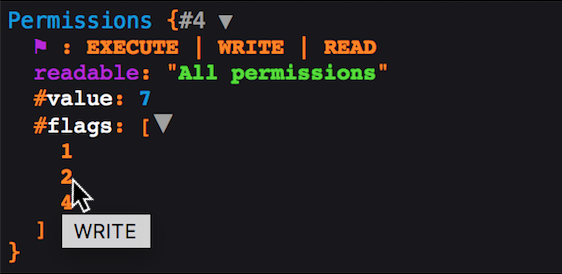
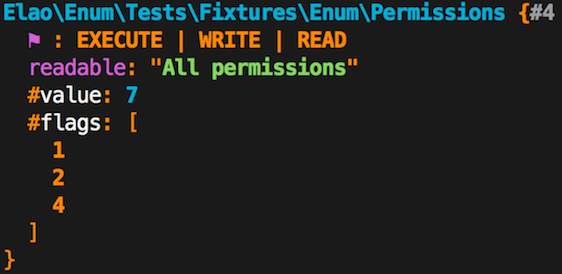

Elao Enumerations
=================
[](https://packagist.org/packages/elao/enum) 
[](https://packagist.org/packages/elao/enum) 
[](https://packagist.org/packages/elao/enum)
[](https://travis-ci.org/Elao/PhpEnums)
[](https://coveralls.io/github/Elao/PhpEnums)
[](https://scrutinizer-ci.com/g/Elao/PhpEnums/?branch=master)
[](http://php.net)

This project aims to provide the missing PHP enumerations support:

```php
<?php

final class Gender extends Enum
{
    use AutoDiscoveredValuesTrait;
    
    const UNKNOWN = 'unknown';
    const MALE = 'male';
    const FEMALE = 'female';
}
```

It will leverage integration of the main PHP frameworks and also provide bridges with other libraries when relevant.

Table of Contents
=================

  * [Why?](#why)
  * [Features](#features)
  * [Installation](#installation)
  * [Usage](#usage)
    * [Readable enums](#readable-enums)
    * [Choice enums](#choice-enums)
    * [Flagged enums](#flagged-enums)
    * [Compare](#compare)
    * [Shortcuts](#shortcuts)
  * [Integrations](#integrations)
    * [Doctrine](#doctrine)
      * [In a Symfony app](#in-a-symfony-app)
      * [Create the DBAL type](#create-the-dbal-type)
      * [Register the DBAL type](#register-the-dbal-type)
        * [Manually](#manually)
        * [Using the Doctrine Bundle with Symfony](#using-the-doctrine-bundle-with-symfony)
      * [Mapping](#mapping)
      * [Default value on null](#default-value-on-null)
    * [Symfony HttpKernel component](#symfony-httpkernel-component)
    * [Symfony Serializer component](#symfony-serializer-component)
    * [Symfony Form component](#symfony-form-component)
      * [Simple enums](#simple-enums)
      * [Flagged enums](#flagged-enums-1)
    * [Symfony Validator component](#symfony-validator-component)
    * [Symfony VarDumper component](#symfony-vardumper-component)
    * [Faker](#faker)
      * [Usage with Alice](#usage-with-alice)
    * [Api-Platform](#api-platform)
      * [OpenApi / Swagger](#openapi--swagger)
    * [JavaScript](#javascript)
  * [API](#api)
    * [Simple enum](#simple-enum)
    * [Readable enum](#readable-enum)
    * [Flagged enum](#flagged-enum)

# Why?

An enumeration is a strong data type providing identifiers you'll use in your application.
Such a type allows libraries and framework integration, which this package will provide when relevant.

<details>

<summary>Show more about enums</summary>

An enumeration is a data type, enclosing a single value from a predictable set of members (enumerators). 
Each enumerator name is a single identifier, materialized by a PHP constant.

**Using an enum class provides many benefits:**

- Brings visibility in your code
- Provides Type Hinting when using the enum class
- Centralizes enumeration logic within a class
- Defines utility methods or minor logic owned by your enumeration
- Helps to describe how to read, serialize, export \[, ...\] an enumeration
- Allows common libraries and frameworks integrations.

Enumerations are not options and are not meant to replace constants. Designing an enum type should be done by keeping your domain in mind, and should convey a strong meaning on your application logic.

**Wrong use-cases:**

- A set of options used by a library or a method.
- An unpredictable set of elements.
- An non-reusable set of elements inside the application.
- Long sets of elements (languages, locales, currencies, ...)
- Holding variable data inside the enum type (use an intermediate value object holding the data and the enum instance instead).

**Valid use-cases:**

- Gender, civility, predictable roles and permissions, ...
- A set of supported nodes in an importer, or a set of predefined attributes.
- In a game: predefined actions, movement directions, character classes, weapon types, ...
- Any other set of restricted elements.

</details>

---

**Why another library ?**

- [`myclabs/php-enum`](https://github.com/myclabs/php-enum) provides a base enum implementation as a class, inspired from `\SplEnum`. However, it doesn't provide as many features nor integrations as we wish to.
- [`commerceguys/enum`](https://github.com/commerceguys/enum) only acts as a utility class, but does not intend to instantiate enumerations. Hence, it doesn't allow as many features nor integrations with third-party libraries and frameworks. Manipulating enums as objects is also one of the first motivations of this project.
- [`yethee/BiplaneEnumBundle`](https://github.com/yethee/BiplaneEnumBundle) is the first library we got inspiration from. But it was designed as a Symfony Bundle, whereas we opted for a component first approach. Integrations are then provided in a dedicated `Bridge` namespace and are not restricted to Symfony.

Finally, we used to create similar classes from scratch in some projects lately.  
Providing our own package inspired from the best ones, on which we'll apply our own philosophy looks a better way to go.

# Features

- Base implementation for simple, readable and flagged (bitmask) enumerations based on the [BiplaneEnumBundle](https://github.com/yethee/BiplaneEnumBundle) ones.
- Symfony Form component integration with form types.
- Symfony Serializer component integration with a normalizer class.
- Symfony Validator component integration with an enum constraint.
- Symfony VarDumper component integration with a dedicated caster.
- Symfony HttpKernel component integration with an enum resolver for controller arguments.
- Doctrine DBAL integration with abstract classes in order to persist your enumeration in database.
- Faker enum provider to generate random enum instances.
- An API Platform OpenApi/Swagger type for documentation generation.
- JavaScript enums code generation.

# Installation

```sh
$ composer require elao/enum
```

In a Symfony app using Flex, the `Elao\Enum\Bridge\Symfony\Bundle\ElaoEnumBundle` bundle should be registered automatically.

# Usage

Declare your own enumeration by creating a class extending `Elao\Enum\Enum`:

```php
<?php

use Elao\Enum\Enum;

final class Gender extends Enum
{
    const UNKNOWN = 'unknown';
    const MALE = 'male';
    const FEMALE = 'female';

    public static function values(): array
    {
        return [
            self::UNKNOWN, 
            self::MALE, 
            self::FEMALE
        ];
    }
}
```

Get an instance of your enum type:

```php
<?php
$enum = Gender::get(Gender::Male);
```

You can easily retrieve the enumeration's value by using `$enum->getValue();`

> 📝 Enum values are supposed to be integers or strings.

> 📝 It's recommended to make your enums classes `final`, because it won't make sense to extend them in most situations (unless you're creating a new base enum type), and you won't need to mock an enum type.

> 💡 You can also use the `AutoDiscoveredValuesTrait` to automagically guess values from the constants defined in your enum, so you don't have to implement `EnumInterface::values()` yourself:

```php
<?php

use Elao\Enum\Enum;
use Elao\Enum\AutoDiscoveredValuesTrait;

final class Gender extends Enum
{
    use AutoDiscoveredValuesTrait;
    
    const UNKNOWN = 'unknown';
    const MALE = 'male';
    const FEMALE = 'female';
}
```

The `AutoDiscoveredValuesTrait` also allows you to discover values from other classes.
Given the following class holding constants:

```php
<?php

namespace MangoPay;

final class EventType
{
    const KycCreated = "KYC_CREATED";
    const KycSucceeded = "KYC_SUCCEEDED";
    const KycFailed = "KYC_FAILED";
}
```

You can create an enum from it by overriding the `AutoDiscoveredValuesTrait::getDiscoveredClasses()` method:

```php
<?php

namespace App\Enum;

use Elao\Enum\Enum;
use Elao\Enum\AutoDiscoveredValuesTrait;

final class MangoPayEventType extends Enum
{
    use AutoDiscoveredValuesTrait;

    protected static function getDiscoveredClasses(): array
    {
        return [self::class, MangoPay\EventType::class];
    }
}

# Usage:
MangoPayEventType::get(MangoPay\EventType::KycCreated);
```

## Readable enums

Sometimes, enums may be displayed to the user, or exported in a human readable way.  
Hence comes the `ReadableEnum`:

```php
<?php

use Elao\Enum\ReadableEnum;

final class Gender extends ReadableEnum
{
    const UNKNOWN = 'unknown';
    const MALE = 'male';
    const FEMALE = 'female';

    public static function values(): array
    {
        return [
            self::UNKNOWN,
            self::MALE,
            self::FEMALE,
        ];
    }

    public static function readables(): array
    {
        return [
            self::UNKNOWN => 'Unknown',
            self::MALE => 'Male',
            self::FEMALE => 'Female',
        ];
    }
}
```

The following snippet shows how to render the human readable value of an enum:

```php
<?php
$enum = Gender::get(Gender::Male); 
$enum->getReadable(); // returns 'Male'
(string) $enum; // returns 'Male'
```

If you're using a translation library, you can also simply return translation keys from the `ReadableEnumInterface::readables()` method:

```php
<?php

use Elao\Enum\ReadableEnum;

final class Gender extends ReadableEnum
{
    // ...
    
    public static function readables(): array
    {
        return [
            self::UNKNOWN => 'enum.gender.unknown',
            self::MALE => 'enum.gender.male',
            self::FEMALE => 'enum.gender.female',
        ];
    }
}
```

Using Symfony's translation component:

```yaml
 # translations/messages.en.yaml
 enum.gender.unknown: 'Unknown'
 enum.gender.male: 'Male'
 enum.gender.female: 'Female'
```

```php
<?php
$enum = Gender::get(Gender::MALE);
// get translator instance...
$translator->trans($enum); // returns 'Male'
```

If you want to extract and update the translations automatically using the [translation extractor command](https://symfony.com/doc/current/translation.html#extracting-translation-contents-and-updating-catalogs-automatically) you can use the provided custom extractor:

```yaml
# config/packages/elao_enum.yaml
elao_enum:
    translation_extractor:
        # mandatory, provides the namespace to path mappings where to search for ReadableEnum (will also search subdirectories)
        paths:
            App\Enum: '%kernel.project_dir%/src/Enum'
        domain: messages # optional, specifies the domain for translations
        filename_pattern: '*.php' # optional, specifies the filename pattern when searching in folders
        ignore: [] # optional, specifies the folders/files to ignore (eg. '%kernel.project_dir%/src/Enum/Ignore/*') 
```

## Choice enums

Choice enums are a more opinionated version of readable enums. Using the `ChoiceEnumTrait` in your enum, you'll only 
need to implement a `choices()` method instead of both `EnumInterface::values()` and `ReadableEnum::readables()` ones:

```php
<?php

use Elao\Enum\ChoiceEnumTrait;
use Elao\Enum\ReadableEnum;

final class Gender extends ReadableEnum
{
    use ChoiceEnumTrait;

    const UNKNOWN = 'unknown';
    const MALE = 'male';
    const FEMALE = 'female';

    public static function choices(): array
    {
        return [
            self::UNKNOWN => 'Unknown',
            self::MALE => 'Male',
            self::FEMALE => 'Female',
        ];
    }
}
```

It is convenient as it implements the two `values` & `readables` methods for you, which means you don't have to keep it in sync anymore.

The `SimpleChoiceEnum` base class allows you to benefit from both choice enums conveniency along with enumerated values auto-discoverability through public constants:


```php
<?php

use Elao\Enum\SimpleChoiceEnum;

final class Gender extends SimpleChoiceEnum
{   
    const UNKNOWN = 'unknown';
    const MALE = 'male';
    const FEMALE = 'female';
}
```

In addition, it'll provide default labels for each enumerated values based on a humanized version of their constant name 
(i.e: "MALE" becomes "Male". "SOME_VALUE" becomes "Some value").
In case you need more accurate labels, simply override the `SimpleChoiceEnum::choices()` implementation.

## Flagged enums

Flagged enumerations are used for bitwise operations.
Each value of the enumeration is a single bit flag and can be combined together into a valid bitmask in a single enum instance.

```php
<?php

use Elao\Enum\FlaggedEnum;

final class Permissions extends FlaggedEnum
{
    const EXECUTE = 1;
    const WRITE = 2;
    const READ = 4;

    // You can declare shortcuts for common bit flag combinations
    const ALL = self::EXECUTE | self::WRITE | self::READ;

    public static function values(): array
    {
        return [
            // Only declare valid bit flags:
            static::EXECUTE,
            static::WRITE,
            static::READ,
        ];
    }

    public static function readables(): array
    {
        return [
            static::EXECUTE => 'Execute',
            static::WRITE => 'Write',
            static::READ => 'Read',

            // You can define readable values for specific bit flag combinations:
            static::WRITE | static::READ => 'Read & write',
            static::EXECUTE | static::READ => 'Read & execute',
            static::ALL => 'All permissions',
        ];
    }
}
```

Get instances using bitwise operations and manipulate them:

```php
<?php
$permissions = Permissions::get(Permissions::EXECUTE | Permissions::WRITE | Permissions::READ);
$permissions = $permissions->withoutFlags(Permissions::EXECUTE); // Returns an instance without "execute" flag
$permissions->getValue(); // Returns 6 (int)
$permissions->getFlags(); // Returns [2, 4] (=> [Permissions::EXECUTE, Permissions::WRITE])

$permissions = $permissions->withoutFlags(Permissions::READ | Permissions::WRITE); // Returns an instance without "read" and "write" flags
$permissions->getValue(); // Returns Permissions::NONE (0). Note: NONE is defined in parent class, FlaggedEnum.
$permissions->getFlags(); // Returns an empty array

$permissions = Permissions::get(Permissions::NONE); // Returns an empty bitmask instance
$permissions = $permissions->withFlags(Permissions::READ | Permissions::EXECUTE); // Returns an instance with "read" and "execute" permissions
$permissions->hasFlag(Permissions::READ); // True
$permissions->hasFlag(Permissions::READ | Permissions::EXECUTE); // True
$permissions->hasFlag(Permissions::WRITE); // False
```

## Compare

Enumeration values are singletons (exact term in this case actually is [multiton](http://designpatternsphp.readthedocs.io/en/latest/Creational/Multiton/README.html)): it means you'll always get the exact same instance for a given value.
Thus, in order to compare two instances, you can simply use the strict comparison operator in order to check references:

```php
<?php
Gender::get(Gender::MALE) === Gender::get(Gender::FEMALE); // False
Gender::get(Gender::MALE) === Gender::get(Gender::MALE); // True
Permissions::get(Permissions::ALL) === Permissions::get(
    Permissions::READ | Permissions::WRITE | Permissions::EXECUTE
); // True
```

You can also override the `EnumInterface::equals(EnumInterface $enumToCompare)` in order to implement your own logic to determine if two instances should be considered the same.  
The default implementation compares both enum type (the class) and value.

```php
<?php
Gender::get(Gender::MALE)->equals(Gender::get(Gender::FEMALE)); // False
Gender::get(Gender::MALE)->equals(Gender::get(Gender::MALE)); // True
```

Lastly, you can simply compare an instance with a value by using the `EnumInterface::is($value)`:

```php
<?php
Gender::get(Gender::MALE)->is(Gender::FEMALE); // False
Gender::get(Gender::MALE)->is(Gender::MALE); // True
```

## Shortcuts

Inspired from [myclabs/php-enum](https://github.com/myclabs/php-enum#static-methods), you can use shortcuts to instantiate your enumerations, thanks to [PHP's `__callStatic` magic method](http://php.net/manual/en/language.oop5.overloading.php#object.callstatic):

```php
<?php
Gender::MALE(); // Returns an instance of Gender with the MALE value
```

We recommend you to use this method, if and only if, you and your team use an IDE (e.g PhpStorm) able to interpret the [`@method` tag](https://phpdoc.org/docs/latest/references/phpdoc/tags/method.html) in class definitions. Then, you can benefit from IDE completion by declaring the following:

```php
<?php

/**
 * @method static Gender UNKNOWN()
 * @method static Gender MALE()
 * @method static Gender FEMALE()
 */
final class Gender extends ReadableEnum
{
    const UNKNOWN = 'unknown';
    const MALE = 'male';
    const FEMALE = 'female';
    
    // ...
}
```

Otherwise, simply implement the static methods yourself.

# Integrations

## Doctrine

You can store the raw value of an enumeration in the database, but still manipulate it as an object from your entities by [creating a custom DBAL type](http://docs.doctrine-project.org/projects/doctrine-orm/en/latest/cookbook/custom-mapping-types.html), from scratch.

However, this library can help you by providing abstract classes for both string and integer based enumerations.

### In a Symfony app

This configuration is equivalent to the following sections explaining how to create a custom Doctrine DBAL type for your enums. 

```yaml
elao_enum:
    doctrine:
        types:
            App\Enum\GenderEnum: gender # Defaults to `{ name: gender, type: string }` for string based enum (translates to VARCHAR)
            App\Enum\AnotherEnum: { name: another, type: enum } # string based enum with SQL ENUM column definition
            App\Enum\Permissions: { name: permissions, type: int } # values are stored as integers. Default for flagged enums.
```

It'll actually generate & register the types classes for you, saving you from writing this boilerplate code.

You can also default to SQL `ENUM` column definitions by default for all types by using:

```yaml
elao_enum:
    doctrine:
        enum_sql_declaration: true
```

Beware that your database platform must support it. Also, the Doctrine diff tool is unable to detect new or removed 
values, so you'll have to handle this in a migration yourself.

### Create the DBAL type

First, create your DBAL type by extending either `AbstractEnumType` (string based enum), `AbstractEnumSQLDeclarationType` (if you want to use SQL `ENUM` column definition for string enums) or `AbstractIntegerEnumType` (integer based enum, for flagged enums for instance):

```php
<?php

use Elao\Enum\Bridge\Doctrine\DBAL\Types\AbstractEnumType;

final class GenderEnumType extends AbstractEnumType
{
    const NAME = 'gender';

    protected function getEnumClass(): string
    {
        return Gender::class;
    }

    public function getName(): string
    {
        return static::NAME;
    }
}
```

### Register the DBAL type

Then, you'll simply need to register your DBAL type:

#### Manually

```php
<?php
// in bootstrapping code
// ...
use Doctrine\DBAL\Types\Type;
Type::addType(GenderEnumType::NAME, GenderEnumType::class);
```

To convert the underlying database type of your new "gender" type directly into an instance of `Gender` when performing schema operations, the type has to be registered with the database platform as well:

```php
<?php
$conn = $em->getConnection();
$conn->getDatabasePlatform()->registerDoctrineTypeMapping(GenderEnumType::NAME, GenderEnumType::class);
```

#### Using the Doctrine Bundle with Symfony

refs: 

- [Registering custom Mapping Types](https://symfony.com/doc/current/doctrine/dbal.html#registering-custom-mapping-types)

```yml
# config/packages/doctrine.yaml
doctrine:
    dbal:
        types:
            gender: App\Doctrine\DBAL\Types\GenderEnumType
```

### Mapping

When registering the custom types in the configuration, you specify a unique name for the mapping type and map it to the corresponding fully qualified class name. Now the new type can be used when mapping columns:

```php
<?php
class User
{
    /** @Column(type="gender") */
    private $gender;
}
```

### Default value on `null`

Two methods allow to set a default value if `null` is retrieved from the database, or before persisting a value:

```php
<?php

abstract class AbstractEnumType extends Type
{
    // ...

    /**
     * What should be returned on null value from the database.
     *
     * @return mixed
     */
    protected function onNullFromDatabase()
    {
        return null;
    }

    /**
     * What should be returned on null value from PHP.
     *
     * @return mixed
     */
    protected function onNullFromPhp()
    {
        return null;
    }
}
```

Override those methods in order to satisfy your needs.

## Symfony HttpKernel component
<a href="https://symfony.com"></a>

An [argument value resolver](https://symfony.com/doc/current/controller/argument_value_resolver.html) allows to 
seamlessly transform an HTTP request parameter (from route/attributes, query string or post parameters, in this order) 
into an enum instance by type-hinting the targeted enum in controller action.

The `Elao\Enum\Bridge\Symfony\HttpKernel\Controller\ArgumentResolver\EnumValueResolver` is automatically registered by the Symfony Bundle.

## Symfony Serializer component 
<a href="https://symfony.com"></a>

The `Elao\Enum\Bridge\Symfony\Serializer\Normalizer\EnumNormalizer` is automatically registered by the Symfony Bundle
and allows to normalize/denormalize any enumeration to/from its value.

## Symfony Form component
<a href="https://symfony.com"></a>

### Simple enums

Simply use the `EnumType`:

```php
<?php

use Elao\Enum\Bridge\Symfony\Form\Type\EnumType;
use MyApp\Enum\Gender;

// ...

$builder->add('gender', EnumType::class, [
    'enum_class' => Gender::class,
]);

// ...

$form->submit($data);
$form->get('gender')->getData(); // Will return a `Gender` instance (or null)
```

Only the `enum_class` option is required.

You can use any [`ChoiceType`](https://symfony.com/doc/current/reference/forms/types/choice.html) option as usual (for instance the `multiple` option).

The field data will be an instance of your enum. If you only want to map values, you can use the `as_value` option:

```php
<?php

use Elao\Enum\Bridge\Symfony\Form\Type\EnumType;
use MyApp\Enum\Gender;

// ...

$builder->add('gender', EnumType::class, [
    'enum_class' => Gender::class,
    'as_value' => true,
]);

// ...

$form->submit($data);
$form->get('gender')->getData(); // Will return a string value defined in the `Gender` enum (or null)
```

You can restrict the list of proposed enumerations by overriding the `choices` option:

```php
<?php

use Elao\Enum\Bridge\Symfony\Form\Type\EnumType;
use MyApp\Enum\Gender;

// ...

$builder->add('gender', EnumType::class, [
    'enum_class' => Gender::class,
    'choices' => [
        Gender::get(Gender::MALE), 
        Gender::get(Gender::FEMALE),
    ],
]);

// or:

$builder->add('gender', EnumType::class, [
    'enum_class' => Gender::class,
    'as_value' => true,
    'choices' => [
        Gender::readableFor(Gender::MALE) => Gender::MALE,
        Gender::readableFor(Gender::FEMALE) => Gender::FEMALE,
    ],
]);
```

Usually, when expecting data to be enum instances, choices must be provided as enum instances too,
while when expecting enumerated values, choices are expected to be raw enumerated values.

The `choices_as_enum_values` allows to act differently: 
- if `true`, the `EnumType` will expect choices to be raw values.
- if `false`, the `EnumType` will expect choices to be enum instances.

By default, this option is set to the same value as `as_value`.

### Flagged enums

Simply use the `FlaggedEnumType` (which extends `EnumType`):

```php
<?php

use Elao\Enum\Bridge\Symfony\Form\Type\FlaggedEnumType;
use MyApp\Enum\Permissions;

// ...

$builder->add('permissions', FlaggedEnumType::class, [
    'enum_class' => Permissions::class,
]);

// ...

$form->submit($data);
$form->get('permissions')->getData(); // Will return a single `Permissions` instance composed of selected bit flags
```

Same options are available, but on the contrary of the `EnumType`, the `multiple` option is always `true` and cannot be set to `false` (You'll always get a single enum instance though).

## Symfony Validator component
<a href="https://symfony.com"></a>

The library provides a `Elao\Enum\Bridge\Symfony\Validator\Constraint\Enum` constraint which makes use of Symfony's built-in [`Choice` constraint](http://symfony.com/doc/current/reference/constraints/Choice.html) and validator internally.

To use the constraint, simply provide the enum `class`:

```yaml
# config/validator/validation.yaml
App\Entity\User:
    properties:
        gender:
            - Elao\Enum\Bridge\Symfony\Validator\Constraint\Enum: MyApp\Enum\Gender
```

If the property value is not an enum instance, set the `asValue` option to true in order to simply validate the enum value:

```yaml
# config/validator/validation.yaml
App\Entity\User:
    properties:
        gender:
            - Elao\Enum\Bridge\Symfony\Validator\Constraint\Enum:
                class: MyApp\Enum\Gender
                asValue: true
```

You can restrict the available choices by setting the allowed values in the `choices` option:

```yaml
# config/validator/validation.yaml
App\Entity\User:
    properties:
        gender:
            - Elao\Enum\Bridge\Symfony\Validator\Constraint\Enum:
                class: MyApp\Enum\Gender
                choices: 
                    - female
                    - !php/const MyApp\Enum\Gender::MALE # You can use PHP constants with the YAML format since Symfony 3.2
```

The `choice` option only accepts enum values and normalize it internally to enum instances if `asValue` is `false`.

You can also use a [`callback`](http://symfony.com/doc/current/reference/constraints/Choice.html#callback):

```yaml
# config/validator/validation.yaml
App\Entity\User:
    properties:
        gender:
            - Elao\Enum\Bridge\Symfony\Validator\Constraint\Enum:
                class: MyApp\Enum\Gender
                callback: 'allowedValues'
```

Where `allowedValues` is a static method of `MyApp\Enum\Gender`, returning allowed values or instances.

Any other [Choice option](http://symfony.com/doc/current/reference/constraints/Choice.html#available-options) (as `multiple`, `min`, ...) is available with the `Enum` constraint.

## Symfony VarDumper component
<a href="https://symfony.com"></a>

By requiring this package and if `symfony/var-dumper` is installed, an `EnumCaster` is registered automatically to enhance enum instances dump output.

For instance, here's what it'll look like when dumping a flagged enum instance:

```php
<?php

use Elao\Enum\Tests\Fixtures\Enum\Permissions;

dump(Permissions::get(Permissions::ALL));
```

|HTML output|CLI output|
|-----------|----------|
|||

## Faker

The PhpEnums library provides an `Elao\Enum\Bridge\Faker\Provider\EnumProvider` to generate fixtures.

Its constructor receives a mapping between class aliases and your Enum classes' FQCN as first parameter:

```php
<?php

use Elao\Enum\Bridge\Faker\Provider\EnumProvider;

$provider = new EnumProvider([
    'Civility' => Namespace\To\MyCivilityEnum::class,
    'Gender' => Namespace\To\MyGenderEnum::class,
]);
```

The provider exposes two public methods:

* `EnumProvider::enum(string $enumValueShortcut): EnumInterface` in order to generate a deterministic enum instance
* `EnumProvider::randomEnum(string $enumClassOrAlias): EnumInterface` in order to generate a random enum instance
* `EnumProvider::randomEnums(string $enumClassOrAlias, int $count, bool $variable = true, int $min = 0): array` in order to generate an array of random (unique) enum instances

### Usage with Alice

If you're using the [nelmio/alice](https://github.com/nelmio/alice) package and the bundle it provides in order to generate fixtures, you can register the Faker provider by using the `nelmio_alice.faker.generator`:

```yml
# config/services.yaml
services:
    Elao\Enum\Bridge\Faker\Provider\EnumProvider:
        arguments:
            - Civility: Namespace\To\MyCivilityEnum
              Gender: Namespace\To\MyGenderEnum
        tags: ['nelmio_alice.faker.provider']
```

The following example shows how to use the provider within a Yaml fixture file:

```yml
MyEntity:
    entity1:
        civility: <enum(Civility::MISTER)>
        # You can use enums outside of map if you specify full path to Enum class:
        gender: <enum("App\Model\Enum\Gender::MALE">
        # You can use the pipe character in order to combine flagged enums:
        permissions: <enum(Permissions::READ|WRITE>
    entity2:
        civility: <randomEnum(Civility)>
        gender: <randomEnum("App\Model\Enum\Gender")>
        permissions: <randomEnum(Permissions)>
```

> 📝 `MISTER` in `<enum(Civility::MISTER)>` refers to a constant defined in the `Civility` enum class, not to a constant's value ('mister' string for instance).

## API Platform

### OpenApi / Swagger

The library provides an `Elao\Enum\Bridge\ApiPlatform\Core\JsonSchema\Type\ElaoEnumType` to generate a OpenApi (formally Swagger) documentation based on your enums. This decorator is automatically wired for you when using the Symfony bundle.

## JavaScript

This library allows to generate JS code from your PHP enums using a command:

```bash
bin/elao-enum-dump-js --lib-path "./assets/js/lib/enum.js" --base-dir="./assets/js/modules" \
    "App\Auth\Enum\Permissions:auth/Permissions.js" \
    "App\Common\Enum\Gender:common/Gender.js"
```

This command generates:
- [library sources](./res/js/Enum.js) at path `assets/js/lib/enums.js` containing the base JS classes
- enums in a base `/assets/js/modules` dir:
    - `Permissions` in `/assets/js/modules/auth/Permissions.js`
    - `Gender` in `/assets/js/modules/common/Gender.js`
    
Simple enums, readables & flagged enums are supported.

Note that this is not meant to be used as part of an automatic process updating your code.
There is no BC promise guaranteed on the generated code. Once generated, the code belongs to you.

### In a Symfony app

You can configure the library path, base dir and enum paths in the bundle configuration:

```yaml
elao_enum:
    elao_enum:
        js:
            base_dir: '%kernel.project_dir%/assets/js/modules'
            lib_path: '%kernel.project_dir%/assets/js/lib'
            paths:
                App\Common\Enum\SimpleEnum: 'common/SimpleEnum.js'
                App\Common\Enum\Gender: 'common/Gender.js'
                App\Auth\Enum\Permissions: 'auth/Permissions.js'
```

Then, use the CLI command to generate the JS files:

```bash
bin/console elao:enum:dump-js [--lib-path] [--base-dir] [<enum:path>...]
```

# API

## Simple enum

Method | Static | Returns | Description
------ | ------ | ------- | -----------
`get($value)` | <kbd>Yes</kbd> | <kbd>static</kbd>| Returns the instance of the enum type for given value.
`values()` | <kbd>Yes</kbd> | <kbd>int[]&#124;string[]</kbd> | Should return any possible value for the enumeration.
`accepts($value)` | <kbd>Yes</kbd> | <kbd>bool</kbd> | True if the value is acceptable for this enumeration.
`instances()` | <kbd>Yes</kbd> | <kbd>static[]</kbd> | Instantiates and returns an array containing every enumeration instance for possible values.
`getValue()` | <kbd>No</kbd> | <kbd>int&#124;string</kbd> | Returns the enumeration instance value.
`equals(EnumInterface $enum)` | <kbd>No</kbd> | <kbd>bool</kbd> | Determines whether two enumerations instances should be considered the same.
`is($value)` | <kbd>No</kbd> | <kbd>bool</kbd> | Determines if the enumeration instance value is equal to the given value.

## Readable enum

Method | Static | Returns | Description
------ | ------ | ------- | -----------
`readables()` | <kbd>Yes</kbd> | <kbd>string[]</kbd> | Should return an array of the human representations indexed by possible values.
`readableFor($value)` | <kbd>Yes</kbd> | <kbd>string</kbd> | Get the human representation for given enumeration value.
`getReadable()` | <kbd>No</kbd> | <kbd>string</kbd> | Get the human representation for the current instance.
`__toString()` | <kbd>No</kbd> | <kbd>string</kbd> | Allows to convert the instance to the human representation of the current value by casting it to a string.

## Flagged enum

Method | Static | Returns | Description
------ | ------ | ------- | -----------
`accepts($value)` | <kbd>Yes</kbd> | <kbd>bool</kbd> | Same as before, but accepts bit flags and bitmasks.
`readableForNone()` | <kbd>Yes</kbd> | <kbd>string</kbd> | Override this method to replace the default human representation of the "no flag" value.
`readableFor($value, string $separator = '; ')` | <kbd>Yes</kbd> | <kbd>string</kbd> | Same as before, but allows to specify a delimiter between single bit flags (if no human readable representation is found for the combination).
`getReadable(string $separator = '; ')` | <kbd>No</kbd> | <kbd>string</kbd> | Same as before, but with a delimiter option (see above).
`getFlags()` | <kbd>No</kbd> | <kbd>int[]</kbd> | Returns an array of bit flags set in the current enumeration instance.
`hasFlag(int $bitFlag)` | <kbd>No</kbd> | <kbd>bool</kbd> | True if the current instance has the given bit flag(s).
`withFlags(int $flags)` | <kbd>No</kbd> | <kbd>static</kbd> | Computes a new value with given flags, and returns the corresponding instance.
`withoutFlags(int $flags)` | <kbd>No</kbd> | <kbd>static</kbd> | Computes a new value without given flags, and returns the corresponding instance.
